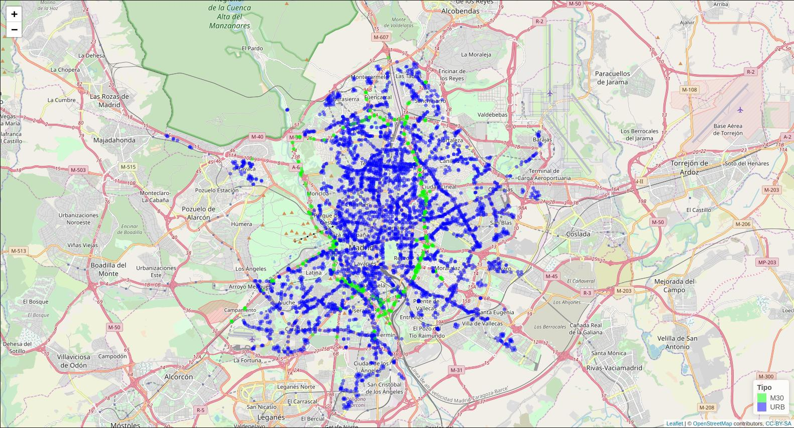

```{r setup, include = FALSE}
require(TFFutils)

tff.setup.knitr()
tff.setup.pander()
knitr::opts_chunk$set(fig.pos = 'H')
```


## Ubicación de los puntos de medida del tráfico


Éste segundo conjunto de datos, [@locations2018madrid], contiene el **histórico de localizaciones de los puntos de medida del flujo de tráfico**. Los datos se publican en archivos que contienen los registros de un mes completo; sin embargo no todos los meses se publican.

La infraestructura de puntos de medida, disponible en la ciudad de Madrid se corresponde con:

* **7.360 detectores de vehículos** con las siguientes características:
    * 71 incluyen dispositivos de lectura de matrículas
    * 158 disponen de sistemas ópticos de visión artificial con control desde el Centro de Gestión de Movilidad
    * 1.245 son específicos de vías rápidas y acceso a la ciudad
    * y el resto de los 5.886, con sistemas básicos de control de semáforos

* **Más de 4.000 puntos de medida**:
    * 253 con sistemas para el control de  velocidad, caracterización de los vehículos y doble lazo de lectura
    * 70 de ellos conforman las estaciones de toma de aforos específicas de la ciudad.
    
Según documenta [@locations2018madrid], los atributos de **los datos de ubicación de los puntos de medida** son los relacionados en el Cuadro \ref{tabs:propiedades-datos-localizacion}.

  ---------------------------------------------------------------------------
  Nombre       Tipo     Descripción
  ------------ -------- -----------------------------------------------------
  cod\_cent    texto    Código de centralización en los sistemas y que se
                        corresponde con el campo <código> de otros conjuntos
                        de datos como el de intensidad del tráfico en tiempo
                        real.
  
  id           entero   Identificador único y permanente del punto de medida.
  
  nombre       texto    Denominación del punto de medida, utilizándose la
                        siguiente nomenclatura: \
                        Para los puntos de medida de tráfico urbano se
                        identifica con la calle y orientación del sentido
                        de la circulación. \
                        Para los puntos de vías rápida y accesos a Madrid se
                        identifica con el punto kilométrico, la calzada y si
                        se trata de la vía central, vía de servicio o un
                        enlace.
  
  tipo\_elem   texto    Descriptor de la tipología del punto de medida según
                        la siguiente codificación: \
                        **&nbsp;&nbsp;URB** (tráfico URBANO) para dispositivos de control
                        semafórico.\
                        **&nbsp;&nbsp;M30** (tráfico INTERURBANO) para dispositivos
                        de vías rápidas y accesos a Madrid.
  
  x            real     Coordenada X\_UTM del centroide de la representación
                        del polígono del punto de medida.
  
  y            real     Coordenada Y\_UTM del centroide de la representación
                        del polígono del punto de medida.
  ---------------------------------------------------------------------------
  
  Table: \label{tabs:propiedades-datos-localizacion}Propiedades del conjunto de datos de ubicación de los puntos de medida del flujo de tráfico


### Tratamiento de los archivos de datos de localización

Al igual que con los datos de medidas, observamos que a lo largo del tiempo, el conjunto de datos de localización ha  cambiado tanto en las propiedades que informa como en el formato de los archivos *csv* en dónde se publican. Nuevamente esto requiere de un trabajo de saneado previo.  

El carácter de separación de campos en el archivo *csv* no siempre es el mismo. A veces hay que leer los archivos considerando que es una coma ',' y otras un punto y coma ';'.

Respecto a la heterogeneidad con la que se presentan los **nombres de las propiedades**, se ha observado que:

* los valores de la propiedad **tipo_elem** viene codificados de forma diferente dependiendo del año y del mes. En particular:
    * **M30**: puede venir codificado como **M30, 'PUNTOS MEDIDA M-30' o M-30**. Adoptamos **M30** como valor maestro.
    * **URB**: puede venir informado como **URBANOS**. Adoptamos **URB** como valor maestro.
* **x**, **st_x** y **utm_x** representan la misma propiedad, que unos meses viene informada con un nombre y otros con otro. Adoptamos **x** como nombre maestro de la propiedad.
* **y**, **st_y** y **utm_y** representan la misma propiedad, que unos meses viene informada con un nombre y otros con otro. Adoptamos **y** como nombre maestro de la propiedad.

Respecto a la heterogeneidad con la que se presentan los **tipos de dato**, se ha comprobado que las coordenadas de localización de los puntos de medida unas veces se guardan utilizando comas ',' como separador de miles y otras puntos '.'. 

Se han desarrollado funciones que realizan de manera transparente todas las correcciones descritas en las líneas anteriores, de manera que se pueda trabajar de forma más cómoda y productiva.

Al igual que en el caso anterior, los archivos con los datos de localización se han guardado apropiadamente en una tabla de una base de datos. Esto simplifica mucho la tarea de operarlos, pues se evita mantener ficheros.


### Muestra de los datos de ubicación de los puntos de medida


Podemos observar una muestra de estos datos en el Cuadro \@ref(tab:locations-sample).

```{r locations-sample}
locations <- tff.get.parsed.location(y=2018, m=9)
pool::poolClose(tff.get.conn())
tff.kable.scaled(head(locations), 
                 hold_position = T,
                 caption = 'Muestra de datos de localización de los puntos de medida (Septiembre 2018)')
```

Y visualmente, sobre un mapa, podemos observar su distribución geográfica en la Figura \@ref(fig:locations-map).


```{r locations-map, fig.cap='Mapa de localización de los Puntos de Medida (Septiembre 2018)', out.width="100%"}

require(knitr)

if (file.exists("images/locations_2018_09.jpg")) {
    
} else {
    require(sp)
    require(leaflet)
    utms <- SpatialPoints(locations[, c("x", "y")], proj4string = CRS("+proj=utm +zone=30T"))
    longlats <- as.data.frame(spTransform(utms, CRS("+proj=longlat")))
    longlats$tipo_elem <- locations$tipo_elem
    pal <- colorFactor(c('green', 'blue'), domain = longlats$tipo_elem)
    m <- leaflet(as.data.frame(longlats)) %>%
        addTiles() %>%
        addCircles(~x, ~y, color = ~pal(tipo_elem), radius = 1) %>%
        addLegend('bottomright', pal = pal, values = ~tipo_elem, title = "Tipo")
    m # Now, save the image in images/locations_2018_09.jpg
}
```

### Análisis de corrupción de los datos de localización

Al igual que con los datos de medidas, podemos observar en qué meses se han informado localizaciones de los dispositivos de medida (Cuadro \@ref(tab:locations-year-month-freq)).

```{r locations-year-month-freq}
require(dplyr)

all.locations <- tff.get.all.parsed.locations(with.ym=T)
pool::poolClose(tff.get.conn())
all.locations %>% 
    mutate(`Año`=year, Mes=month) %>% 
    mutate(year=NULL,month=NULL) %>% 
    group_by(`Año`, Mes) %>% 
    summarise(Dispositivos=n()) %>% 
    arrange(desc(`Año`), desc(Mes)) %>% 
    tff.kable.default(caption = 'Dispositivos que informan localización por año y mes')
```

En particular, resulta interesante estudiar cuánto ha variado el valor de localización por dispositivo a lo largo del tiempo. 

Hemos comprobado que **considerando todo el histórico de localizaciones** de terminales, **4.065 de los 4.141** se han visto **sometidos a cambios superiores a 1 unidad en sus coordenadas de localización** (Cuadro \ref{tabs:all-locations-diff-summary}).


```{r resumen-localizacion-todo}
# TODO: esto no se dibuja bien en pdf y no sé por qué es
# all.locations %>%
#     group_by(id) %>%
#     summarise_at(vars(x, y), funs(min, max)) %>%
#     mutate(x_diff = x_max - x_min, y_diff = y_max - y_min) %>%
#     filter(x_diff > 1 | y_diff > 1) %>%
#     select(id, x_diff,y_diff) %>%
#     tff.dfSummary(caption = '\\label{tabs:all-locations-diff-summary}Resumen de dispositivos cuya variación en la localización es superior a la unidad (todo el histórico de datos))')
```


  -----------------------------------------------------------------------------------------
  No   Variable    Estadístico / Valor            Freqs (% Válidos)      Válidos  Perdidos  
  ---- ----------- ------------------------------ ---------------------- -------- ---------
  1    id\         Media (sd) : 5701.7 (1852.8)\  4065 diferentes        4065\    0\       
       [entero]    min < med < max:\                                     (100%)   (0%)     
                   0 < 5450 < 10337\                                                       
                   IQR (CV) : 2083 (0.3)                                                   
  
  2    x_diff\     Media (sd) : 109.3 (4.4)\      4065 diferentes        4065\    0\       
       [numerico]  min < med < max:\                                     (100%)   (0%)     
                   0.5 < 109.4 < 146.1\                                                    
                   IQR (CV) : 0 (0)                                                        
  
  3    y_diff\     Meadia (sd) : 207.4 (9.5)\     4064 diferentes       4065\     0\       
       [numerico]  min < med < max:\                                    (100%)    (0%)     
                   1.2 < 207.5 < 426.1\                                                    
                   IQR (CV) : 0 (0)                                                        
  -----------------------------------------------------------------------------------------

Table: \label{tabs:all-locations-diff-summary}Resumen de dispositivos cuya variación en la localización es superior a la unidad (todo el histórico de datos)


Sin embargo, considerando sólo **datos de localización de los terminales desde Noviembre de 2017**, vemos que **sólo 18 dispositivos** tienen cambios significativos en sus coordenadas de localización (Cuadro \ref{tabs:all-locations-diff-from-november-summary}).

```{r}
# TODO: esto no se dibuja bien en pdf y no sé por qué es
# all.locations %>%
#     filter(year>=2017 & month>=11) %>% 
#     group_by(id) %>%
#     summarise_at(vars(x, y), funs(min, max)) %>%
#     mutate(x_diff = x_max - x_min, y_diff = y_max - y_min) %>%
#     filter(x_diff > 1 | y_diff > 1) %>%
#     select(id, x_diff,y_diff) %>%
#     tff.dfSummary(caption = '\\label{tabs:all-locations-diff-from-november-summary}Resumen de dispositivos cuya variación en la localización es superior a la unidad (desde Noviembre de 2017)')
```


  ---------------------------------------------------------------------------------------
  No   Variable    Estadístico / Valor            Freqs (% Válidos)    Válidos  Perdidos  
  ---- ----------- ------------------------------ -------------------- -------- ---------
  1    id\         Media (sd) : 6726.6 (2118.2)\  18 diferentes        18\      0\       
       [entero]    min < med < max:\                                   (100%)   (0%)     
                   3714 < 6229 < 10280\                                                  
                   IQR (CV) : 1782 (0.3)                                                 
  
  2    x_diff\     Media (sd) : 8.4 (8.8)\        18 diferentes        18\      0\       
       [numerico]  min < med < max:\                                   (100%)   (0%)     
                   0.2 < 4.8 < 35.1\                                                     
                   IQR (CV) : 8.9 (1)                                                    
  
  3    y_diff\     Media (sd) : 5.3 (4.1)\        18 diferentes        18\      0\       
       [numerico]  min < med < max:\                                   (100%)   (0%)     
                   0.9 < 4.5 < 13.4\                                                     
                   IQR (CV) : 7.1 (0.8)                                                  
  ---------------------------------------------------------------------------------------
  
  Table: \label{tabs:all-locations-diff-from-november-summary}Resumen de dispositivos cuya variación en la localización es superior a la unidad (desde Noviembre de 2017)


**Esto claramente nos indica que los datos de localización históricos están corruptos.** 


Conclusiones:

* **los datos históricos de localización sólo son válidos a partir de Noviembre de 2017**
* **desde Noviembre de 2017, sólo son fiables los datos de localización del 98,5% de los terminales**
* **los terminales que caen en el 1,5% cuya localización padece de modificaciones desde Noviembre de 2017 los vamos a descartar** en nuestro estudio, por alguna de las siguientes razones:
    * porque su localización esté corrupta en el histórico de localizaciones
    * porque verdaderamente hayan podido cambiar de localización a lo largo del tiempo, lo cual implicaría una complejidad excesiva en el resto de esta investigación


