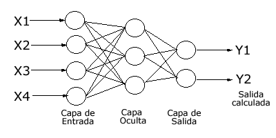

```{r setup, include = FALSE}
require(TFFutils)
require(magrittr)
require(DBI)
require(RMySQL)
require(padr)
require(imputeTS)
require(keras)
require(xts)
require(ggplot2)
require(reshape2)
require(broom)
require(lubridate)
require(forecast)
require(png)
require(grid)
require(gridExtra)
tff.setup.knitr()
tff.setup.pander()

knitr::opts_chunk$set(fig.pos = 'H')
knitr::opts_chunk$set(fig.width=6, fig.height=4, out.width='60%', fig.align='center')
```


# Métodos basados en Deep Learning

Las redes neuronales artificiales son un modelo computacional vagamente inspirado en el comportamiento observado en su homólogo biológico. Consiste en un conjunto de unidades, llamadas neuronas artificiales, conectadas entre sí para transmitirse señales. La información de entrada atraviesa la red neuronal (dónde se somete a diversas operaciones) produciendo unos valores de salida. Las redes neuronales artificiales pueden utilizarse como métodos de pronóstico de series temporales, como veremos más adelante. 

Cada neurona está conectada con otras a través de unos **enlaces**. En estos enlaces el valor de salida de la neurona anterior es multiplicado por un **valor de peso**. Estos pesos en los enlaces pueden **incrementar o inhibir el estado de activación de las neuronas adyacentes**. Del mismo modo, a la salida de la neurona, puede existir una **función limitadora o umbral**, que modifica el valor resultado o impone un límite que se debe sobrepasar antes de propagarse a otra neurona. Esta función se conoce como **función de activación**.


Así, tenemos la capa de entrada formada por las entradas a la red, la capa de salida formada por las neuronas que constituyen la salida final de la red, y las capas ocultas formadas por las neuronas que se encuentran entre los nodos de entrada y de salida. Una RNA puede tener varias capas ocultas o no tener ninguna. Las conexiones sinápticas (las flechas que llegan y salen de las neuronas) indican el flujo de la señal a través de la red, y tienen asociadas un peso sináptico correspondiente. Si la salida de una neurona va dirigida hacia dos o más neuronas de la siguiente capa, cada una de estas últimas recibe la salida neta de la neurona anterior. La cantidad de capas de una RNA es la suma de las capas ocultas más la capa de salida.

Un ejemplo sencillo de perceptrón multicapa (RNA con capas ocultas) lo podemos ver en la Figura \@ref(fig:perceptron-multicapa):

```{r perceptron-multicapa, fig.cap='Ejemplo de perceptrón multicapa', out.width = "40%"}

```

El problema habitual con este tipo de redes multicapa es el de, dados un conjunto de datos ya clasificados, de los que se conoce la salida deseada, proporcionar los pesos adecuados de la red para que se obtenga una aproximación correcta de las salidas si la red recibe únicamente los datos de entrada.


Estos sistemas aprenden y se forman a sí mismos, en lugar de ser programados de forma explícita, y sobresalen en áreas donde la detección de soluciones o características es difícil de expresar con la programación convencional. Para realizar este aprendizaje automático, normalmente, se intenta minimizar una **función de pérdida** que evalúa la red en su total. Los valores de los pesos de las neuronas se van actualizando buscando reducir el valor de la función de pérdida. Este proceso se realiza mediante la **propagación hacia atrás**.


El objetivo de la red neuronal es resolver los problemas de la misma manera que el cerebro humano, aunque las redes neuronales son más abstractas. Las redes neuronales actuales suelen contener desde unos miles a unos pocos millones de unidades neuronales.


Las redes neuronales se han utilizado para resolver una amplia variedad de tareas, como la visión artificial y el reconocimiento de voz, que son difíciles de resolver usando la ordinaria programación basada en reglas. Históricamente, el uso de modelos de redes neuronales marcó un cambio de dirección significativo a finales de los años ochenta. Se pasa de sistemas expertos con conocimiento incorporado en reglas a sistemas caracterizados por el conocimiento incorporado en los parámetros de un modelo cognitivo.

Históricamente, el avance clave en el desarrollo de las redes neuronales fue el **algoritmo de propagación hacia atrás** que resuelve eficazmente el problema del entrenamiento rápido de redes neuronales de múltiples capas [@werbos1975beyond]. El proceso de propagación hacia atrás utiliza la diferencia entre el resultado producido y el resultado deseado para cambiar los "pesos" de las conexiones entre las neuronas artificiales.


Este algoritmo de entrenamiento de la red por propagación hacia atrás se puede resumir muy brevemente en los siguiente puntos:

- Empezar con unos pesos sinápticos cualesquiera (generalmente elegidos al azar).
- Introducir datos de entrada (en la capa de entrada) elegidos al azar entre el conjunto de datos de entrada que se van a usar para el entrenamiento.
- Dejar que la red genere un vector de datos de salida (propagación hacia delante).
- Comparar la salida generada por al red con la salida deseada.
- La diferencia obtenida entre la salida generada y la deseada (denominada error) se usa para ajustar los pesos sinápticos de las neuronas de la capa de salidas.
- El error se propaga hacia atrás (back-propagation), hacia la capa de neuronas anterior, y se usa para ajustar los pesos sinápticos en esta capa.
- Se continúa propagando el error hacia atrás y ajustando los pesos hasta que se alcance la capa de entradas.
- Este proceso se repetirá con los diferentes datos de entrenamiento. 


Sin embargo, para redes de múltiples capas que usan la propagación hacia atrás se presenta **el problema del desvanecimiento del gradiente**. Un caso particular son las redes neuronales recurrentes (RNNs). **Aunque los errores se propagan de una capa a otra, disminuyen exponencialmente con el número de capas, y eso impide el ajuste hacia atrás de los pesos de las neuronas basado en esos errores**. Las redes profundas se ven particularmente afectadas. Más adelante veremos cómo resolver este problema mediante el uso de unas redes concretas.


## Estrategias de pronóstico 

En los problemas con series temporales es muy común pronosticar más de un valor en el futuro. En particular, esto es la parte central del  objetivo de este trabajo. Para este fin, se debe elegir una estrategia de varios pasos adelante. 

Esta cuestión suele abordarse de dos formas diferentes, que describimos a continuación, pues utilizar una u otra ha sido del todo relevante en los resultados arrojados por los métodos basados en redes neuronales. 


### La estrategia de entrada múltiple y salida múltiple

Esta estrategia se caracteriza por el uso de un vector de valores objetivo. La longitud de este vector es igual a la cantidad de períodos a pronosticar. Por ejemplo, pronosticar el flujo de tráfico para las próximas 48 horas a intervalos de 15 minutos conlleva un vector objetivo de $48*4=192$ valores. La cantidad de valores pasados de la serie que se consideren para pronosticar el vector objetivo es independiente del tamaño del vector objetivo y dependerá en cada caso del algoritmo que se utilice y de la naturaleza del problema.

En esta estrategia, una sóla ejecución del algoritmo, con los datos pasados que necesite, da como resultado el pronóstico con el horizonte necesario.


### La estrategia recursiva

La estrategia recursiva o iterativa es el enfoque utilizado, por ejemplo, por ARIMA (método paramétrico, como vimos más arriba) para pronosticar varios períodos. Básicamente, se utiliza un modelo que solo pronostica un paso adelante, de modo que el modelo se aplica de forma iterativa para pronosticar todos los períodos futuros. Cuando las observaciones históricas que se usen como características de la nueva instancia no estén disponibles, se pueden usar predicciones previas en su lugar.


 
