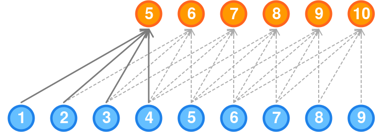

```{r setup, include = FALSE}
require(TFFutils)
require(magrittr)
require(DBI)
require(RMySQL)
require(padr)
require(imputeTS)
require(keras)
require(xts)
require(ggplot2)
require(reshape2)
require(broom)
require(lubridate)
require(forecast)
require(png)
require(grid)
require(gridExtra)
tff.setup.knitr()
tff.setup.pander()

knitr::opts_chunk$set(fig.pos = 'H')
knitr::opts_chunk$set(fig.width=6, fig.height=4, out.width='60%', fig.align='center')
```


## Redes autorregresivas


Un primer acercamiento al uso de redes neuronales para el problema del pronóstico del flujo de tráfico es utilizar las conocidas como redes neuronales autorregresivas. 


```{r NNAR-basic, fig.cap='Arquitectura NNAR básica', out.width = "40%"}

```


La clave para el uso de este tipo de redes es considerar los datos ordenados de la serie temporal como entradas de la red, del mismo modo que usamos los valores retrasados en un modelo de autorregresión lineal. A estos modelos se les llama redes neuronales de autorregresión o modelos NNAR.

Cuando se trata de pronósticos utilizando este algoritmo, la red se aplica de forma iterativa. Para pronosticar un paso adelante, simplemente utilizamos las entradas históricas disponibles. Para pronosticar dos pasos adelante, usamos el pronóstico de un paso como entrada, junto con los datos históricos. Este proceso continúa hasta que hayamos computado todos los pronósticos requeridos.

En lugar de implementar este tipo de redes desde cero, para los experimentos que se han realizado en este trabajo se ha utilizado la función *nnetar* del paquete *forecast* [@R-forecast].

Sin embargo, los resultados obtenidos con este algoritmo para la batería de experimentos realizados no han sido buenos. Aparte de lo negativo de los resultados, los tiempos de cálculo son muy superiores a los utilizados por otros algoritmos y métodos tratados. Esto motiva que el presente estudio no  haya seguido esta línea y que no se incluyan los resultados en las tablas que se incluyen en los distintos apartados.


